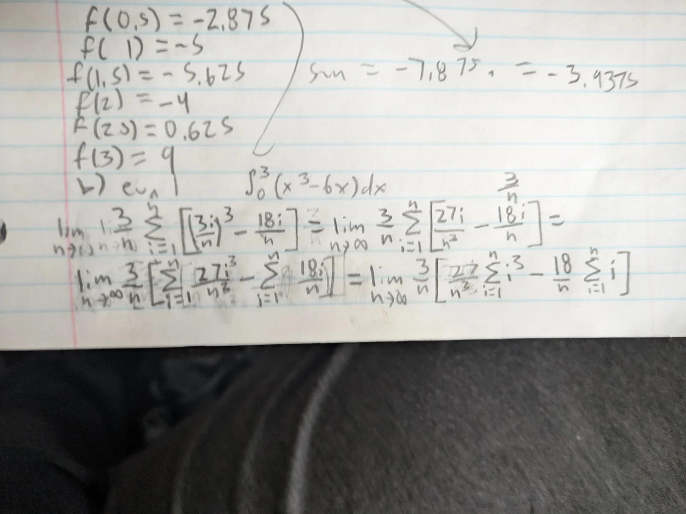
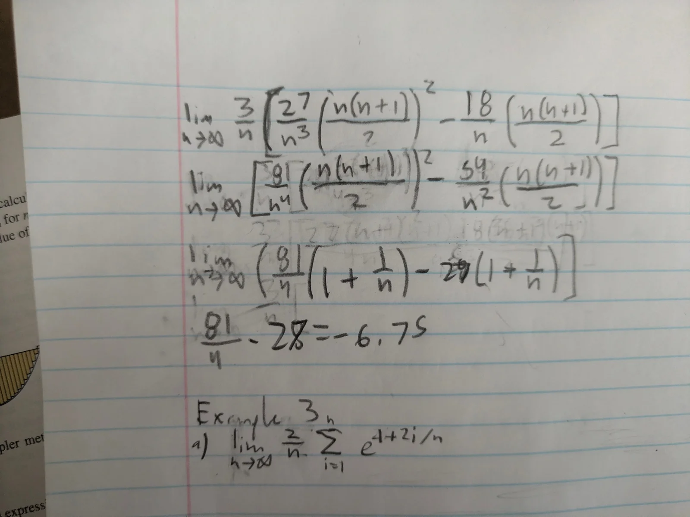
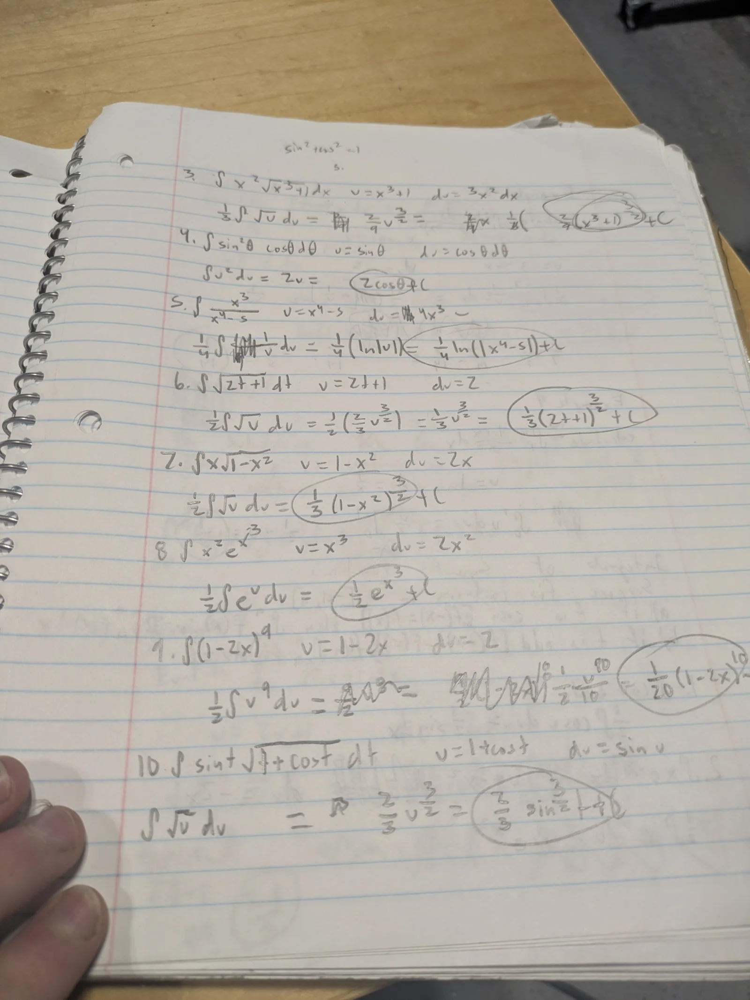

The main RP5 board sends over 2 byte DShot commands over SPI for the RP2040 to send to the ESCs over DSHOT. The SPI task on the RP2040 first syncs the bytes by waiting for the peripheral select pin to go low, before reading from the rx buffer. The DSHOT command format includes a checksum nibble which is used to sync the command frames. When the transmission succeeds without checksum error for crate::spi::SYNC_THRESHOLD iterations, the sync section finishes, and the task proceeds to normal operation.

```rust
// spi_interface.rs
#[embassy_executor::task]
pub async fn spi_task(
    mut cs_pin: Input<'static>,
    mut sms: SmDriverBatch
) {
    info!("Spawned core0 executor and SPI task!");
    let mut read_buffer = [0u8; 2];
    let mut synced_count = 0;
    // Sync before writing commands
    loop {
        cs_pin.wait_for_falling_edge().await;

        read(&mut read_buffer);

        let computed_crc = StandardDShotVariant::compute_crc(u16::from_le_bytes(read_buffer));
        let received_crc = read_buffer[1] & 0x0F;

        if computed_crc == received_crc {
            if synced_count >= crate::spi::SYNC_THRESHOLD {
                info!("Successfully synced SPI!");
                break;
            }

            synced_count += 1;
        } else {
            wait_one_transmission();
            synced_count = 0;
        }
    }

    loop {
        cs_pin.wait_for_falling_edge().await;

        read(&mut read_buffer)
        let computed_crc = StandardDShotVariant::compute_crc(u16::from_le_bytes(read_buffer));
        let received_crc = read_buffer[1] & 0x0F;

        if computed_crc == received_crc {
          write_dshot(&mut sms, transfer_buffer).await;
        } else {
          warn!("SPI command crc missmatch detected!");
        }
    }
}
```

The task is supported by a robust macro-based config system that allows for the user to set a few values at the macro callsite which propogate throughout the setup process:

```rust
// spi.rs
define_spi_config! {
    peripheral: SPI0,
    clock_pin: 2,
    tx_pin: 3,
    rx_pin: 4,
    cs_pin: PIN_6,
    baud_rate: 12_500_000,
    polarity: false,
    phase: false,
    sync_threshhold: 3,
}
```

The RP5 mainboard, on the other hand, does not need to calculate checksums, is working with a higher level interface, and currently has placeholder logic for command construction, and so is compartably simpler.

```rust
// spi_interface.rs
#[instrument]
pub async fn interface_handler() {
    let mut spi = config::spi::new()
        .unwrap_or_else(|err| panic!("Failed to initialize SPI peripheral! Error: {err}"));

    let write_buffer: [u8; 2];
    if let Some(frame) = DShotFrame::<StandardDShotVariant>::from_throttle(1028, true) {
        write_buffer = frame.inner().to_le_bytes();
    } else {
        panic!("Failed to construct DShot command frame! Throttle exceeded maximum value!");
    }

    loop {
        if let Err(write_err) = spi.write(&write_buffer) {
            error!("Failed to tranfer over SPI! Error: {}", write_err);
        }
    }
}
```

I also implemented UDP in a concurrent manner to allow for reading/writing from multiple different tasks; again fairly trivial. The program will attempt to bind to the local addres, and then bind to the remote, retrying if the connection fails, using values from the config.

```rust
// config.rs
#[cfg(feature = "udp")]
pub mod udp {
    use std::time::Duration;

    pub const LOCAL_ADDR: &str = "0.0.0.0:8080";
    pub const REMOTE_ADDR: &str = "127.0.0.1:1234";

    pub const INIT_CONNECT_TIMEOUT: Duration = Duration::from_secs(1);
    pub const MAX_INIT_CONNECT_ATTEMPTS: u8 = 255;
}

// main.rs/main()
#[cfg(feature = "udp")] {
    use tracing::warn;
    let sock = UdpSocket::bind(config::udp::LOCAL_ADDR).await
        .unwrap_or_else(|err| panic!("Unable to bind to UDP socket! Error: {err}"));

    let mut attempts = 0u8;
    while attempts < config::udp::MAX_INIT_CONNECT_ATTEMPTS {
        match timeout(config::udp::INIT_CONNECT_TIMEOUT, sock.connect(config::udp::REMOTE_ADDR)).await {
            Ok(Ok(())) => break,
            Ok(Err(err)) => panic!("Failed to establish UDP remote connection! Error {err}"),
            Err(elapsed) => {
                warn!("UDP remote connection timed out! Elapsed: {}", elapsed);
                attempts += 1;
            }
        }
    }

    let sock_arc = Arc::new(sock);
}
```

The custom PIO program for the rp2040, which I also spent significant time debugging is sumarised by its generation function:

```rust
pub const STANDARD_DSHOT_PROGRAM_SIZE: usize = 22;
#[must_use]
pub fn generate_standard_dshot_program(timings: &StandardDShotTimings) -> Program<STANDARD_DSHOT_PROGRAM_SIZE> {
    let mut a = Assembler::new();

    // Labels
    let mut init = a.label();
    let mut maybe_pull = a.label();
    let mut frame_delay_loop = a.label();
    let mut blocking_pull = a.label();
    let mut start_frame = a.label();
    let mut check_bit = a.label();
    let mut start_bit = a.label();
    let mut do_one = a.label();
    let mut do_zero = a.label();

    a.bind(&mut init);
    a.jmp(JmpCondition::Always, &mut blocking_pull);

    a.bind(&mut maybe_pull);
    a.mov(MovDestination::Y, MovOperation::None, MovSource::ISR);
    a.jmp(JmpCondition::YIsZero, &mut blocking_pull);
    a.pull(false, false); // noblock
    a.nop_with_delay(timings.frame_timings.frame_delay_remainder); // Repeat mode is enabled, delay is needed to control frame rate
    a.set(SetDestination::Y, timings.frame_timings.frame_delay_count);

    a.bind(&mut frame_delay_loop);
    a.jmp_with_delay(JmpCondition::YIsZero, &mut start_frame, timings.frame_timings.frame_delay);
    a.jmp(JmpCondition::YDecNonZero, &mut frame_delay_loop);

    a.bind(&mut blocking_pull);
    a.pull(false, true); // block

    a.bind(&mut start_frame); // Store the value for re-use next time
    a.mov(MovDestination::X, MovOperation::None, MovSource::OSR);
    a.jmp(JmpCondition::XIsZero, &mut blocking_pull); // wait for non-zero value
    a.out(OutDestination::Y, 16); // discard 16 most significant bits

    a.bind(&mut check_bit);
    a.jmp(JmpCondition::OutputShiftRegisterNotEmpty, &mut start_bit);
    a.jmp(JmpCondition::Always, &mut maybe_pull);

    a.bind(&mut start_bit);
    a.out(OutDestination::Y, 1);
    a.jmp(JmpCondition::YIsZero, &mut do_zero);

    a.bind(&mut do_one);
    a.set_with_delay(SetDestination::PINS, 1, timings.bit_timings.one_high_delay);
    a.set_with_delay(SetDestination::PINS, 0, timings.bit_timings.one_low_delay);
    a.jmp(JmpCondition::Always, &mut check_bit);

    a.bind(&mut do_zero);
    a.set_with_delay(SetDestination::PINS, 1, timings.bit_timings.zero_high_delay);
    a.set_with_delay(SetDestination::PINS, 0, timings.bit_timings.zero_low_delay);
    a.jmp(JmpCondition::Always, &mut check_bit);

    a.assemble_program()
}
```

As far as my math journey towards EKFs is going, I ended last week with starting on integration as it was introduced in the textbook I'm working through:
with horrible limits of sums!




As of wednesday I've gotten past the fundemental theorem and am now thouroughly familiar with basic integration



I used hugo to make my website, which involved learning some basic go and hugo-specific syntax, as well as SCSS. I have set up, at this point, a very easy system for the creation of blog posts.

I also created a tag and automatic word count system for posts

```html
{{/*  tags.html  */}}
{{ with . }}
    <p>
        <svg xmlns="http://www.w3.org/2000/svg" width="24" height="24" viewBox="0 0 24 24" fill="none" stroke="currentColor" stroke-width="2" stroke-linecap="round" stroke-linejoin="round" class="feather feather-tag meta-icon"><path d="M20.59 13.41l-7.17 7.17a2 2 0 0 1-2.83 0L2 12V2h10l8.59 8.59a2 2 0 0 1 0 2.82z"></path><line x1="7" y1="7" x2="7" y2="7"></line></svg>

        {{ range . -}}
            <span class="tag"><a href="{{ "tags/" | absLangURL }}{{ . | urlize }}/">{{.}}</a></span>
        {{ end }}
    </p>
{{ end }}

{{/*  single.html  */}}
<p>
    <svg xmlns="http://www.w3.org/2000/svg" width="24" height="24" viewBox="0 0 24 24" fill="none" stroke="currentColor" stroke-width="2" stroke-linecap="round" stroke-linejoin="round" class="feather feather-file-text">
    <path d="M14 2H6a2 2 0 0 0-2 2v16a2 2 0 0 0 2 2h12a2 2 0 0 0 2-2V8z"></path>
    <polyline points="14 2 14 8 20 8"></polyline>
    <line x1="16" y1="13" x2="8" y2="13"></line>
    <line x1="16" y1="17" x2="8" y2="17"></line>
    <polyline points="10 9 9 9 8 9"></polyline>
    </svg>
    {{ i18n "wordCount" .Page.WordCount }}
</p>
```

and a main page, again keeping as much as possible paramterized, so that I can easily change anything `hugo.toml` in the future.

```html
{{/* index.html */}} {{ define "main" }}
<div class="content-center">
  <main>
    <div>
      <h1>{{ .Site.Title }}</h1>

      {{ partial "subtitle.html" . }} {{- with .Site.Params.social }}
      <div>{{ partial "social-icons.html" . }}</div>
      {{- end }}
    </div>
  </main>
</div>
{{ end }}
```

Here's the posts page html:

```html
{{ define "main" }} {{ $paginator := .Paginate .Data.Pages }}

<div class="content">
  <main class="posts">
    <h1>posts</h1>

    {{ if .Content }}
    <div class="content">{{ .Content }}</div>
    {{ end }} {{ range $paginator.Pages.GroupByDate "2006" }}
    <div class="posts-group">
      <div class="post-year">{{ .Key }}</div>

      <ul class="posts-list">
        {{ range .Pages }}
        <li class="post-item">
          <a href="{{.Permalink}}" class="post-item-inner">
            <span class="post-title">{{.Title}}</span>
            <span class="post-day">
              {{ if .Site.Params.dateformShort }} {{ time.Format
              .Site.Params.dateformShort .Date }} {{ else }} {{ time.Format "Jan
              2" .Date }} {{ end }}
            </span>
          </a>
        </li>
        {{ end }}
      </ul>
    </div>
    {{ end }} {{ partial "pagination-list.html" . }}
  </main>
</div>
{{ end }}
```

The random date is just a random default I don't remember why I chose that date but I did.\
The about page uses the same code as the posts, so don't look too closely ;)
