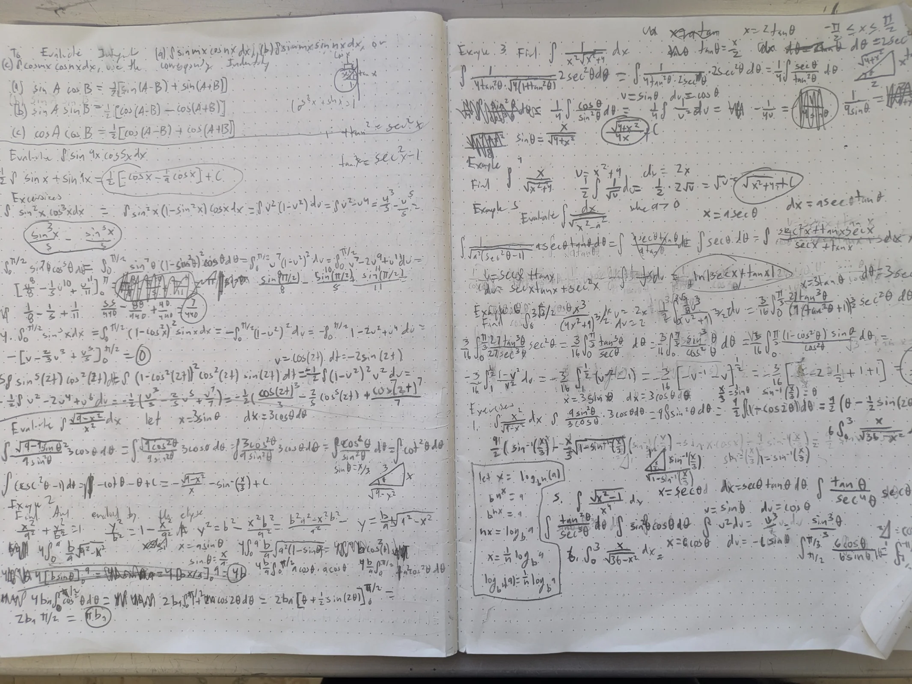

I tried for most of Tuesday, Wednesday, and Thursday to get my custom SPI peripheral implementation to work.\
I was able to get some data, which changed when the input data was changed, but had extreme difficulty figuring out exactly what went wrong.

I tried DMA and interupts, changing baudrates, and debugging every step of the process.\
I eventually realized that this was something I could figure out later, since other steps of the ROV were more important for the work of other team members.\
Making the decision to switch to I2C during robotics, club, I got it working in under 15 minutes.\
I historically used an async hal embassy_rp, but this doesn't have a spi_slave implementation, which is why I was driven to write one myself.
Since I don't need async, I could use rp2040_hal crate instead, which would require a rewrite, and even more time consumption, but I can do that at a later date (this weekend?)
Here's the peripheral side

```rust
// motor-controller::core0
#[embassy_executor::task]
pub async fn i2c_task(
    mut device: I2cSlave<'static, crate::i2c::I2cPeripheral>,
    mut sms: SmDriverBatch,
) {
    info!("Spawned core0 executor and telemetry task!");

    let mut write_buffer = [0u8; 2];
    loop {
        match device.listen(&mut write_buffer).await {
            // Ignore erronous partial write err arising from two-byte write
            Ok(i2c_slave::Command::Write(_)) | Err(i2c_slave::Error::PartialWrite(_)) => {
                info!("recieved the following command: {:08b}", write_buffer);
                write_dshot(&mut sms, write_buffer).await;
            },
            Ok(_) => warn!("Received erroneous i2c instruction!"),
            Err(error) => error!("Error in reading I2C: Error {}", error)
        }
    }
}
```

For some reason, when sending two bytes, it throws an error that the amount of received data exceeds the buffer size available, but all data seems to be transmitted fine. Interestingly, this only seems to happen when sending two or few bytes, which is the case in this dummy implementation, which pushes the same DShot command to all connected servos. This will not be a problem when sending the full 11 bytes (11 bits/frame * 8 frames = 88 bits = 11 bytes), and is also the reason for the top match arm also matching the partial write error variant.

As with the other parts of this project I made an easily customizable config file:

```rust
// motor-controller::i2c
macro_rules! define_i2c_config {
    (
        peripheral: $i2c_peripheral:ty,
        scl_pin: $scl_pin:ty,
        sda_pin: $sda_pin:ty,
        addr: $addr:expr,
        general_call: $general_call:expr,
        scl_pullup: $scl_pullup:expr,
        sda_pullup: $sda_pullup:expr,
    ) => {
        // Asserts that the types of the given SLC pin, SDA, and I2C Peripheral are valid
        assert_impl!($scl_pin: SclPinTrait<$i2c_peripheral>);
        assert_impl!($sda_pin: SdaPinTrait<$i2c_peripheral>);

        pub type I2cPeripheral = $i2c_peripheral;

        /// Gets the correct peripherals based on configured I2C
        #[macro_export]
        macro_rules! get_i2c_peripherals {
            ($peripherals:ident) => {
                pastey::paste! { ($peripherals.[<$i2c_peripheral>], $peripherals.[<$scl_pin>], $peripherals.[<$sda_pin>]) }
            }
        }

        /// Binds the i2c interrupt corresponding to the provided `i2c_peripheral`
        #[macro_export]
        macro_rules! bind_i2c_interrupt {
            () => {
                pastey::paste! {
                    bind_interrupts!(struct I2cIrq {
                        [<$i2c_peripheral _IRQ>] => embassy_rp::i2c::InterruptHandler<$i2c_peripheral>;
                    });
                }
            }
        }

        /// Initilizes a new [`i2c_slave::Config`] object given the config values set in config module
        pub fn new() -> i2c_slave::Config {
            let mut config = i2c_slave::Config::default();
            config.addr = $addr;
            config.general_call = $general_call;
            config.scl_pullup = $scl_pullup;
            config.sda_pullup = $sda_pullup;

            config
        }
    };
}

define_i2c_config! {
    peripheral: I2C0,
    scl_pin: PIN_5,
    sda_pin: PIN_4,
    addr: 0x60,
    general_call: false,
    scl_pullup: false,
    sda_pullup: false,
}
```

And I made some modifications to the mainboard side I2C implementation I wrote earlier for use with AHT20 temperature and humidity sensor, and the BNO055 IMU, to allow for this:

```rust
#[instrument]
pub async fn interface_handler() {
    info!("Started I2C interface handler!");
    let i2c = config::i2c::new()
        .unwrap_or_else(|err| panic!("Failed to initalize I2C peripheral! Error: {err}"));

    // Small overhead of atmoics when using only one sensor, but we'll always use more in normal operation; changing isn't worth additional code complexity.
    let i2c_refcell = AtomicCell::new(i2c);

    // setup of other I2C peripherals here...

    let mut motor_controller_handle = AtomicDevice::new(&i2c_refcell);

    let write_buffer: [u8; 2];

    if let Some(frame) = DShotFrame::<StandardDShotVariant>::from_throttle(512, true) {
        write_buffer = frame.inner().to_le_bytes();
        info!("Fake frame to write: Raw: [{:08b}, {:08b}]", write_buffer[0], write_buffer[1]);
    } else {
        panic!("Failed to construct DShot command frame! Throttle exceeded maximum value!");
    }

    // let write_buffer = [0xFF, 0x00, 0xFF];
    loop {
        if let Err(err) = motor_controller_handle.write(config::motor_controller::I2C_ADDR, &write_buffer) {
            match err {
                AtomicError::Busy => error!("Driver requirments not met for i2c synchronization!"),
                AtomicError::Other(i2c_err) => error!("I2c error in motor controller write! Error {i2c_err}")
            }
        }
        // get data from other i2c sensors here...
    }
}
```

After this, I attempted to get my troubleshoot my DShot PIO implementation.
A few things that I realized I missed:

```rust
// motor-controller::dshot
fn set_sm_config<'d, PIO: Instance, const SM: usize> (
    sm: &mut StateMachine<'d, PIO, SM>,
    prg: &embassy_rp::pio::LoadedProgram<'d, PIO>,
    pin: &Pin<'d, PIO>
) {
    let mut config = pio::Config::<PIO>::default();

    // 🚫 Nothing present

    // ✅ Forgot to tell the specific state state machine to use the program,
    // not just loading into the PIO block memory.
    config.use_program(prg, &[]);

    config.clock_divider = PIO_CLOCK_DIVIDER;

    config.set_set_pins(&[pin]);
    config.set_out_pins(&[pin]);

    sm.set_config(&config);
}

// motor-controller::core0
async fn write_dshot(sms: &mut SmDriverBatch, buffer: [u8; 2]) {
    let first_byte = buffer[0];

    if let Ok(command) = DShotCommand::try_from(first_byte) {
        // Handle as command
        for_each_driver!(sms, |driver| {
            driver.write_command(command, true).await.unwrap_or_else(|err| {
                error!("Error while writing DShot command to PIOs. Error: {}", err);
            });
        });
    } else {
        // Handle as throttle
        let raw = u16::from_le_bytes([buffer[0], buffer[1]]);

        // 🚫 Subtracted 48 from the raw, so.
        // checked_sub() subtracts the function argument from the value it is called on
        // Its not a wrapping function like checked_sub(raw - 48)
        // So this would just always yield 48
        let Some(throttle) = raw.checked_sub(raw - 48) else {
            error!("Invalid raw value: {}", raw);
            return;
        };

        // ✅ Should instead just supply 48 to the function argument
        let Some(throttle) = raw.checked_sub(48) else {
            error!("Invalid raw value: {}", raw);
            return;
        };

        for_each_driver!(sms, |driver| {
            driver.write_throttle(throttle, true).await.unwrap_or_else(|err| {
                error!("Error while writing Dshot throttle to PIOs. Error {}", err);
            });
        });
    }
}
```

There's a few more, but I have not yet gotten my DShot PIO code to work. In this effort I created a dummy PIO program to simply toggle on and off a pin repeatedly, and an explicit, hardcoded function to set it up. This worked.

```rust
pub fn generate_blink_program() -> Program<4> {
    let mut a = Assembler::new();

    let mut loop_label = a.label();

    a.bind(&mut loop_label);
    a.set(SetDestination::PINDIRS, 1);           // Set pin to OUTPUT
    a.set_with_delay(SetDestination::PINS, 1, 31); // Set HIGH, delay 32 cycles
    a.set_with_delay(SetDestination::PINS, 0, 31); // Set LOW, delay 32 cycles
    a.jmp(pio::JmpCondition::Always, &mut loop_label); // Loop forever

    a.assemble_program()
}

pub fn test_pio_blink<'d, P: embassy_rp::pio::PioPin>(
    pio0: &mut Pio<'d, PIO0>,
    pin: embassy_rp::Peri<'d, P>
) {
    let program = generate_blink_program();

    let prg = pio0.common.load_program(&program);

    let pio_pin = pio0.common.make_pio_pin(pin);

    let mut config = pio::Config::<PIO0>::default();

    config.clock_divider = 128u8.into();

    config.set_set_pins(&[&pio_pin]);

    config.use_program(&prg, &[]);

    pio0.sm0.set_config(&config);

    pio0.sm0.set_enable(true);
}
```

This worked fairly well, and I so I plan to continue debugging in the coming week.

Additionally, I have completed a few additional sections of the Calculus textbook. I finished chapter 6 last weekend (Applications of Integration), and moved on to chapter seven (Techniques of Integration), up to 7.3 (Integration by parts, Trigonometric Integrals, and Trigonometric Substitution). I wanted to make more progress, but midterm week has hampered my progress.


