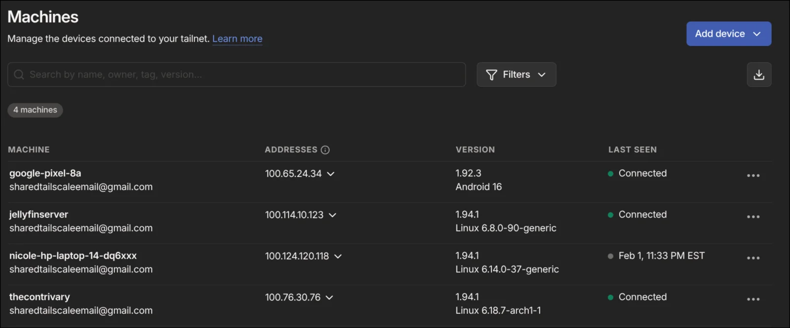

At 11:30pm at night, I thought it an opportune time to setup a Jellyfin music server on an old computer I had lying around. It has two 500GB SATA SSDs. I installed Ubunutu server LTS, for the sake of simplicity, designating one drive for Tailscale cache and the server itself, and the other to hold the music, lyrics and other files. I used caddy to set up a simply reverse proxy, and then connected the computer to my Tailscale network. [This guide](https://jellyfin.org/docs/general/post-install/networking/tailscale/) proved immensely helpful. I failed to keep track of time, and didn't finish until nearly 4 in the morning.

Here is a picture of the console:


I up Tailscale to autostart on my laptop in my hyprland config, and downloaded the Tailscale app on my phone, to allow me to VPN to my house and access my music from anywhere securely.

Here's Jellyfin working on my phone:


And here it is on school wifi on my computer:


I successfully tested my motor controller code with a brushless motor, demonstrating that my custom PIO program worked. Here was the program I used:

```rust
    let mut start_frame = a.label();
    let mut check_empty = a.label();
    let mut start_bit = a.label();
    let mut do_one = a.label();
    let mut do_zero = a.label();
    let mut end_frame = a.label();
    let mut frame_delay_loop = a.label();

    a.set(SetDestination::PINDIRS, 1);

    a.bind(&mut start_frame);
    // Attempt update (when block = false, copies X reg to OSR if nothing to pull)
    a.pull(false, false);
    // Save new frame
    a.mov(MovDestination::X, MovOperation::None, MovSource::OSR);
    // Retry if frame is empty
    a.jmp(JmpCondition::XIsZero, &mut start_frame);
    a.jmp(JmpCondition::Always, &mut start_bit);

    a.bind(&mut check_empty);
    a.jmp(JmpCondition::OutputShiftRegisterNotEmpty, &mut start_bit);
    a.jmp(JmpCondition::Always, &mut end_frame);

    a.bind(&mut start_bit);
    a.out(OutDestination::Y, 1);
    a.jmp(JmpCondition::YIsZero, &mut do_zero);

    a.bind(&mut do_one);
    a.set_with_delay(SetDestination::PINS, 1, timings.bit_timings.one_high_delay);
    a.set_with_delay(SetDestination::PINS, 0, timings.bit_timings.one_low_delay);
    a.jmp(JmpCondition::Always, &mut check_empty);

    a.bind(&mut do_zero);
    a.set_with_delay(SetDestination::PINS, 1, timings.bit_timings.zero_high_delay);
    a.set_with_delay(SetDestination::PINS, 0, timings.bit_timings.zero_low_delay);
    a.jmp(JmpCondition::Always, &mut check_empty);

    a.bind(&mut end_frame);
    a.nop_with_delay(timings.frame_timings.frame_delay_remainder);
    a.set(SetDestination::Y, timings.frame_timings.frame_delay_count);

    a.bind(&mut frame_delay_loop);
    a.jmp_with_delay(JmpCondition::YDecNonZero, &mut frame_delay_loop, 31);
    a.jmp(JmpCondition::Always, &mut start_frame);
```

This implementation of the motor controller, however, still used the embassy async framework, which was no longer necessary, now that we were offloading DSHOT telemetry processing to the main Raspberry Pi 5.

I re-wrote the motor controller using the rp_pico board support package instead of the embassy_rp hal. This hal is lower level, requiring more boilerplate. Here's the new main function, which cycles through the throttle values, writing them to gpio pin 13.

```rust
#[entry]
fn main() -> ! {
    // get peripheral singletons
    let mut pac = pac::Peripherals::take().unwrap();
    let core = pac::CorePeripherals::take().unwrap();

    let mut watchdog = hal::Watchdog::new(pac.WATCHDOG);

    let clocks = hal::clocks::init_clocks_and_plls(
        rp_pico::XOSC_CRYSTAL_FREQ,
        pac.XOSC,
        pac.CLOCKS,
        pac.PLL_SYS,
        pac.PLL_USB,
        &mut pac.RESETS,
        &mut watchdog,
    )
    .ok()
    .unwrap();

    let sio = hal::Sio::new(pac.SIO);

    let pins = rp_pico::Pins::new(
        pac.IO_BANK0,
        pac.PADS_BANK0,
        sio.gpio_bank0,
        &mut pac.RESETS,
    );

    let sys_clk_freq_hz = clocks.system_clock.freq().to_Hz();

    let mut delay = cortex_m::delay::Delay::new(core.SYST, sys_clk_freq_hz);

    let (mut pio0, sm0, _, _, _) = pac.PIO0.split(&mut pac.RESETS);

    let program = pio_program::generate(sys_clk_freq_hz / u32::from(crate::config::pio::CLOCK_DIV));
    let installed = pio0
        .install(&program)
        .expect("Failed to install PIO program!");

    let _esc_pin: gpio::Pin<_, gpio::FunctionPio0, gpio::PullNone> = pins.gpio13.reconfigure();

    let (mut sm0, _, sm0_tx) = PIOBuilder::from_installed_program(installed)
        .set_pins(13, 1)
        .clock_divisor_fixed_point(crate::config::pio::CLOCK_DIV, 0)
        .autopull(false)
        .out_shift_direction(hal::pio::ShiftDirection::Left)
        .build(sm0);

    sm0.set_pindirs([(13, hal::pio::PinDir::Output)]);

    let _sm0 = sm0.start();

    let mut sm0_driver = crate::driver::DShotDriver::new(sm0_tx);

    // Enable 3d mode (command needs to be sent 6 times), so should only need ([`crate::config::pio::UPDATE_RATE`] / 6)^-1 seconds
    // with 40_000 update rate, 0.15ms, but give overhead
    sm0_driver.write_command(Command::ThreeDModeOn, false);
    delay.delay_ms(1);

    loop {
        for throttle in 0..2000 {
            let _ = sm0_driver.try_write_throttle(throttle, false);

            delay.delay_ms(2);
        }
    }
}
```

The old version only drove the motor forward. Here we send a command to enable 3D mode, which maps the lower 1000 throttle values to reverse. This command needs to be sent six times, to avoid accidental triggering. Because my PIO program resends the last command until it receives a new one, we simply send the ThreeDModeOn command and wait until 6 messages are sent to the ESC.

I also overhauled the PIO program, simplifying it significantly and using the wrap functionality to avoid a jmp instruction.

```rust
    let mut start_frame = a.label();
    let mut start_bit = a.label();
    let mut do_one = a.label();
    let mut do_zero = a.label();
    let mut check_empty = a.label();
    let mut end_frame = a.label();
    let mut frame_delay_loop = a.label();
    let mut wrap_source = a.label();

    a.bind(&mut start_frame);
    // .wrap_target
    a.pull(false, false);
    a.mov(MovDestination::X, MovOperation::None, MovSource::OSR);
    a.jmp(JmpCondition::XIsZero, &mut start_frame);

    a.bind(&mut start_bit);
    a.out(OutDestination::Y, 1);
    a.jmp(JmpCondition::YIsZero, &mut do_zero);

    a.bind(&mut do_one);
    a.set_with_delay(SetDestination::PINS, 1, timings.one_high_delay);
    a.set_with_delay(SetDestination::PINS, 0, timings.one_low_delay);
    a.jmp(JmpCondition::Always, &mut check_empty);

    a.bind(&mut do_zero);
    a.set_with_delay(SetDestination::PINS, 1, timings.zero_high_delay);
    a.set_with_delay(SetDestination::PINS, 0, timings.zero_low_delay);
    // Make do_one and do_zero instruction counts the same
    a.jmp(JmpCondition::Always, &mut check_empty);

    a.bind(&mut check_empty);
    a.jmp(JmpCondition::OutputShiftRegisterNotEmpty, &mut start_bit);

    a.bind(&mut end_frame);
    a.nop_with_delay(timings.frame_delay_remainder);
    a.set(SetDestination::Y, timings.frame_delay_iterations);

    a.bind(&mut frame_delay_loop);
    a.jmp_with_delay(
        JmpCondition::YDecNonZero,
        &mut frame_delay_loop,
        MAX_PIO_DELAY,
    );
    a.bind(&mut wrap_source);
    // .wrap

    a.assemble_with_wrap(wrap_source, start_frame)
```

This successfully reduced the instruction count from 19 to 15, manifesting in a reduction in the per-frame instruction overhead from 5 to 1.
