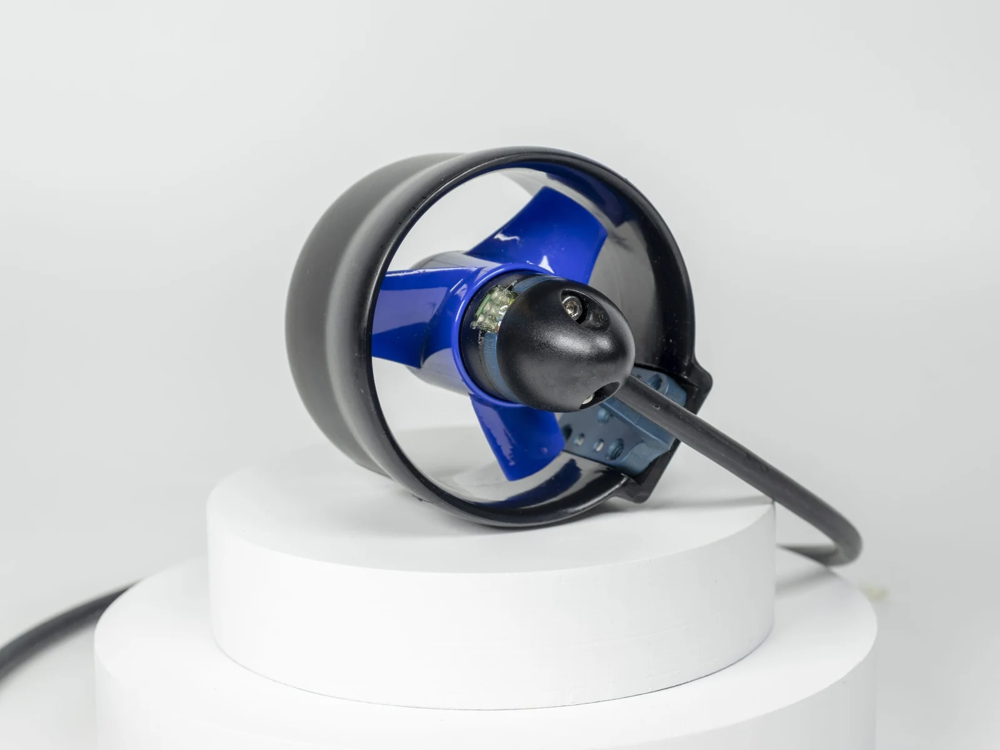
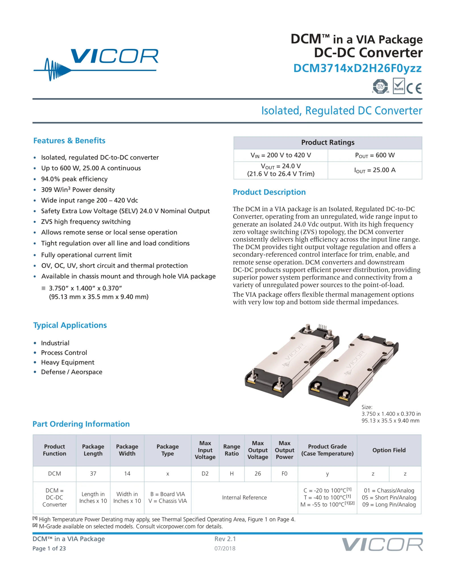
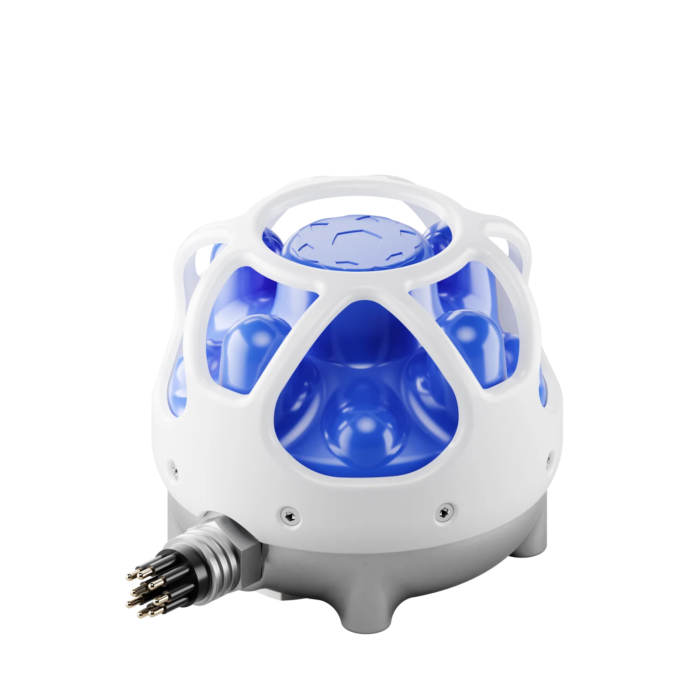

After getting my custom PIO DShot implementation working last week, I needed to someone run the motor in reverse as well as forward. Checking the DShot specification, I needed to send the correct command. These commands occupy the lower 48 values of the 11 bits of data in a DShot packet.

| Number | Command                    | Remark   |
| ------ | -------------------------- | -------- |
| 0..6   | ...                        | ...      |
| 7      | DSHOT_CMD_SPIN_DIRECTION_1 | Needs 6x |
| 8      | DSHOT_CMD_SPIN_DIRECTION_2 | Needs 6x |
| 9      | DSHOT_CMD_3D_MODE_OFF      | Needs 6x |
| 10     | DSHOT_CMD_3D_MODE_ON       | Needs 6x |
| 11..47 | ...                        | ...      |

Here there's 4 commands that are responsible for managing motor direction are shown (7-10). Commands 7 and 8 switch the motor direction, and 3D mode maps the lower half of the throttle values to reverse. I attempted to send these commands, but the ESC wasn't appropriately updating the spin direction. It turns out that despite the specification on Lumenier's website, the locked BlueHeli firmware meant the ESC could not receive these commands.

After this setback I spoke with the rest of the team regarding what was the status of their contributions to the ROV. Frustrated with the limited extent of their research, I found suitable thrusters, ESCs, DC-DC converters, and USBL sensors myself, reaching out to multiple USBL companies to see if they'd be willing to sponsor us.





Advanced Navigation said they would lend us their Subsonus USBL system for a few weeks when we were ready.


After discussing with my advisor I decided to redo the motor controller code this time for the STM32F405, a much more powerful chip used by most professional flight controllers.

I spent a day messing with the company's propriatery software for generating the HAL files and the startup code for various peripherals. I realized while doing so that I couldn't directly use the generated code since I needed to write across all the PWM CCP registers at once to efficently make use of the available DMA channels, which was not a capability of the software. Since the SPI slave code generated would work, I proceeded with the HAL. I had some difficulty with Neovim finding header files but I resolved this. After another day, I realized that since I had to bypass so much of the HAL anyways, and using it effectively would require not only intimate knowledge of the two datasheets, but also the structure of the HAL itself, I thought it would be better to only link against the lower-level peripheral access library. I spent a while writing the initialization code, and am mostly done, except for the Timers and SPI, but forgot some of the initial flash memory setup. Here's what I have so far.

```C
#include "stm32f405xx.h"
#include <stdint.h>

int main(void) {
  // TODO: Recreate MX_Hal_Init() function from the HAL autogenerated code

  // Set clock power settings
  // Enable Clock
  RCC->APB1ENR |= RCC_APB1ENR_PWREN;
  (void)RCC->APB1ENR;
  // Set Clock voltage to mode 1 to enable 168MHz operation
  PWR->CR |= PWR_CR_VOS;
  (void)PWR->CR;

  // Enable HSE Clock [RM0090 6.2.1]
  RCC->CR |= RCC_CR_HSEON; // Enable External Crystal

  // Configure Clock Scaling for 168 MHz Clock [RM0090 Figure 16 & 6.2.3]
  RCC->PLLCFGR =
      // Set M Prescaler to 6, PLL gets 2 MHz (12MHz / 6)
      (6 << RCC_PLLCFGR_PLLM_Pos)
      // Set N Prescaler so frequency is now 336MHz (2MHz * 168)
      | (168 << RCC_PLLCFGR_PLLN_Pos)
      // Set P Prescaler to minumum value 00=/2, so 168MHz (336MHz / 2)
      | (0 << RCC_PLLCFGR_PLLP_Pos)
      // Set Q Prescaler to 4 to achieve 42MHz value.
      // Prescaler must still be set within valid range to use PLL despite
      // unused peripherals.
      | (4 << RCC_PLLCFGR_PLLQ_Pos)
      // Set the PLL source to external crystal
      | RCC_PLLCFGR_PLLSRC_HSE;

  // Enable Phased Clock Loop (for 168MHz conversion) [RM0090 6.2.3]
  RCC->CR |= RCC_CR_PLLON;

  RCC->CFGR =
      // Set PLL as the system clock
      RCC_CFGR_SW_PLL
      // Set the AHB prescaler to no division so AHB has the maximum 168MHz
      | RCC_CFGR_HPRE_DIV1
      // Set APB1 prescaler to /4 to achieve maximum 42MHz value
      | RCC_CFGR_PPRE1_DIV4
      // SET APB2 prescaler to /2 to achieve maximum 84 MHz value
      | RCC_CFGR_PPRE2_DIV2;

  // Enable Clock Security System [RM0090 6.2.7]
  RCC->CR |= RCC_CR_CSSON;

  // Enable Peripheral Clocks
  RCC->AHB1ENR |=
      // Enable GPIO [DS8626 Table 9 & Figure 12, RM0090 6.3.5]
      RCC_AHB1ENR_GPIOAEN   // For TIM1
      | RCC_AHB1ENR_GPIOBEN // For SPI2
      | RCC_AHB1ENR_GPIOCEN // For TIM8
      | RCC_AHB1ENR_GPIOHEN // For External Oscilator
      // Enable DMA1 Controller Clock
      | RCC_AHB1ENR_DMA1EN;

  (void)RCC->AHB1ENR;
}
```

Writing requires referencing both the RM0090 datasheet which details the architecture and the DS8626 datasheet which discusses physical aspects of the hardware (pin mappings, etc.).
