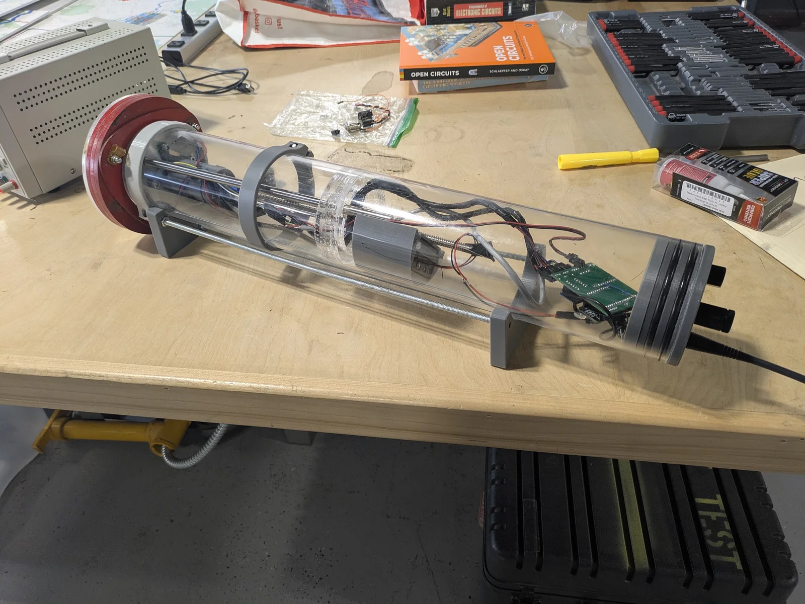
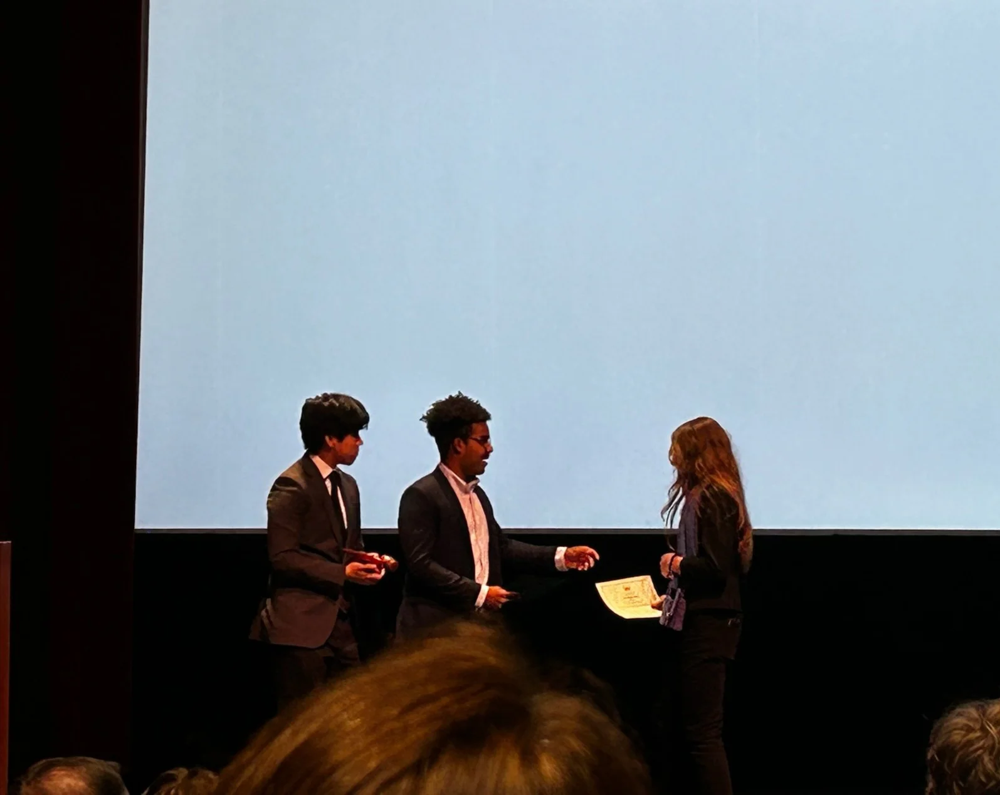

Hello! My name is Alachie Yeager and I am a student at [Massachusetts Academy of Math and Sciences at WPI](https://www.massacademy.org"). 

I have broad intrest across many subjects, but have historically pursued underwater robotics at [Medford High](https://mhs-mvths.mps02155.org). As a member of [Sunk Robotics](). There, I firist designed and built a a vertically profiling float the traverses in the water column to collect samples at different depths. This float utilized a piston-based boyancy engine for movement, and an pressure, pH, and turbidity sensor to measure water parameters.

Currently we're working on a tethered ROV with a 500 meter operating depth. This has been a great challange, not only from a mechanical design perspective, but also electrical in delivering that power from the surface, and software, in regards to obtaining acurrate positional information.

I also historically have participated extensively in student government. I served as a student representative to Medford School commitee, as well as to regional and state-level assembelies. I spearheaded an effort to add a 7th period to the schoolday, which enabled vocation students who attend their shop half of the day to take their desired higher-level classes. Fellow representatives and I also reformed student demonstration policy, and overhauled the transportation system, allowing buses to reach more students for the same cost.

I'm also an avid reader. My favorite book is probably Ian Bank's *Surface Detail*. I also enjoy historical fiction like *All the Light We Cannot See*, among others. My favorite non-fiction book is *Germs, Guns, and Steel*.

I've also participated in Model United Nations, winning a plethora of awards a myriad of confrences. Here's a picture of me recieved an award at Dartmouth MUN:

